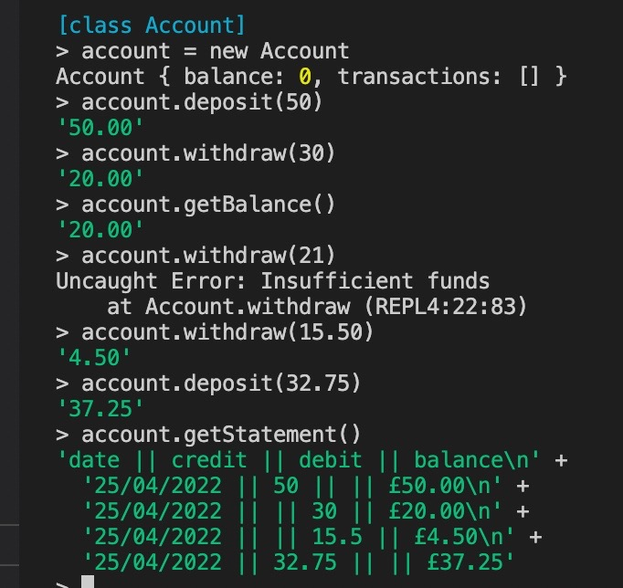

# Bank Tech Test

## Description

As a tech test while attending the Makers Academy boot camp, I built this interactive bank account program intended only for use in the Node REPL. It lets you create a new account, desposit and withdraw funds, and view a statement in a specified format.

The instructed output format was as follows:

```
date || credit || debit || balance
14/01/2023 || || 500.00 || 2500.00
13/01/2023 || 2000.00 || || 3000.00
10/01/2023 || 1000.00 || || 1000.00
```

## Instructions for Use

* Clone this repo
* Install nvm and Node
* Move into the project directory
* Run the command `node` to initiate the REPL and then load the application with `.load src/account.js`
* To run the tests, install Jest with `npm install jest` and then run simply `jest`

## Example of Use in Node REPL

* Here I create a new account, which initializes with an empty balance and list of transactions

* I then deposit £50, withdraw £30 and check my balance, which is now £20

* Then I try to withdraw £21, prompting an 'insufficient funds' error message

* After a couple of further transactions, I print my statement



## My Approach

1. Test-driving an Account class, first expecting it to initialize with a balance of 0

2. Test-driving a deposit function, followed by a withdraw function working on the inverse logic, giving the latter a guard clause that throws an 'insufficient funds' error if the withdrawal amount exceeds the existing balance - for this I made a getBalance method that returns the balance to 2 decimal places

3. Creating private functions for recording deposits and withdrawals in the requested format and adding them to the transactions array for use in the eventual printing of the statement

## Improvements I Would Like to Implement

* With more time, I would have liked to refactor a lot of the Account class's logic into separate Transaction and Statement models

* A snazzy user interface would be nice, but that wasn't part of the specification

[Jonny Abrams](https://github.com/jonnyabrams)